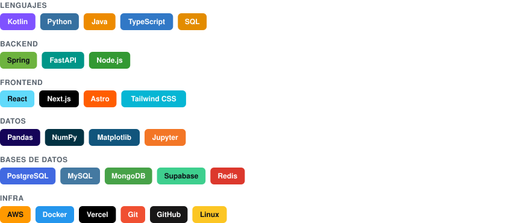

<!-- BEGIN:hero -->
```text
╭──────────────────────────────────────────────────────────────────────────────────╮
│                                                                                  │
│        .   ^i}txf\||))()1}_I.                                                    │
│         '-tunxx\1]_]_<~_}11))?;                                                  │
│     .  +nUrt\|1)//|/\{[_+__+_{\t]        diego@github                            │
│    . :\j1]}1{{(|)){{(((|\]__-__}mm^      ────────────────────────────            │
│     lx|}}{)}1t}}{{}{}{{)//)[-?]??Xq;     Nombre           Diego Peña y Lillo     │
│    :x(}}]?-__tt{[[{1{1{)/tfut_+_-~fJ'    Rol              Backend & Data         │
│    t\{[?]?_+~+|rvt|1(\/tffft[~<<+[[t(    Ubicación        Chile                  │
│    x11]??___-_<iuar(|\ffttt1+_~<_[{{n                                            │
│    r1{]]????-__>xmf/\|||\({__~<<_}{]x    Repos            6                      │
│    n)1}[[?]?--_~nXrjtt/)]-_]-~<+-]?]v    Estrellas        2                      │
│    t/{1[]]]?--_-fXxjr\?~~~+??_-?[[_rr    Seguidores       5                      │
│    ;x1[{[??????[|Xnr}ii<~~~+_?}[[])C^    Contribuciones   672                    │
│     !f1}1}?___-]xcnr1+~+<<~_-[{}?1cI     Pull requests    14                     │
│    . :(\){]?_~~_[|1}1[}1{-_?[{[{/(^      Racha            11 días                │
│     .  ~/j)?_+~>>+)t{]?--__-{/f|i        En GitHub        2 años                 │
│          i{||(fYCO8p/((tj\))1?I                                                  │
│            'l+xa$$$$$$$B*X+:                                                     │
│                                                                                  │
╰──────────────────────────────────────────────────────────────────────────────────╯
```
<!-- END:hero -->

## 🔥 Rachas

<!-- BEGIN:streaks -->
```text
╭───────────────────────────┬───────────────────────────┬──────────────────────────╮
│                           │                           │                          │
│            672            │            11             │            19            │
│  Contribuciones totales   │    Racha actual · días    │  Racha más larga · días  │
│     desde 20 oct 2023     │     26 jul 2026 → hoy     │ 15 oct 2025 → 2 nov 2025 │
│                           │                           │                          │
╰───────────────────────────┴───────────────────────────┴──────────────────────────╯
```
<!-- END:streaks -->

## 📊 Lenguajes

<!-- BEGIN:languages -->

<!-- END:languages -->

## 🏆 Logros

<!-- BEGIN:achievements -->
```text
╭──────────────────────────────────────────────────────────────────────────────────╮
│                                                                                  │
│         Commits         672   [  A  ]   ██████░░░░░░   faltan 328 para S         │
│         Repos             6   [  B  ]   ████░░░░░░░░   faltan 4 para A           │
│         Estrellas         2   [  C  ]   ██░░░░░░░░░░   faltan 8 para B           │
│         Seguidores        5   [  C  ]   ██░░░░░░░░░░   faltan 5 para B           │
│         Pull requests    14   [  B  ]   ████░░░░░░░░   faltan 36 para A          │
│         Issues           68   [  S  ]   ████████░░░░   faltan 32 para SS         │
│         Experiencia       2   [  B  ]   ████░░░░░░░░   faltan 1 para A           │
│                                                                                  │
╰──────────────────────────────────────────────────────────────────────────────────╯
```
<!-- END:achievements -->

## 🛠️ Tecnologías

<!-- BEGIN:tech -->

<!-- END:tech -->

---

<!-- BEGIN:footer -->
<sub>Actualizado automáticamente el 5 ago 2026 por <a href=".github/workflows/refresh-readme.yml">GitHub Actions</a> — generado con los scripts de <a href="scripts/">scripts/</a>, sin servicios externos en el render.</sub>
<!-- END:footer -->
