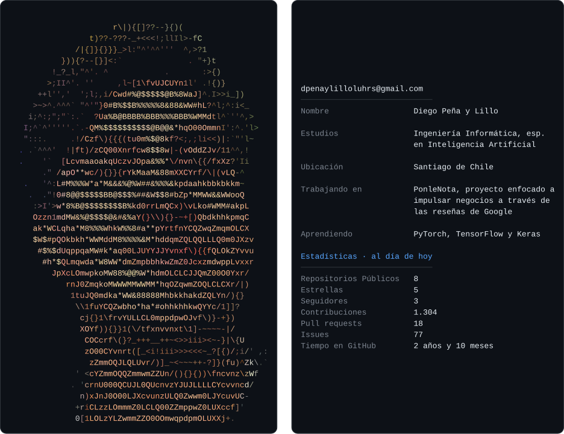
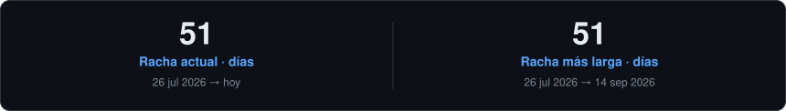
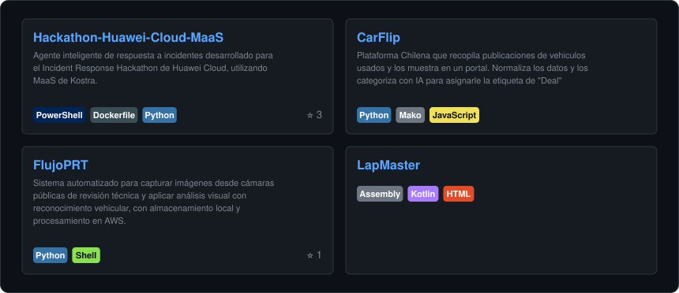
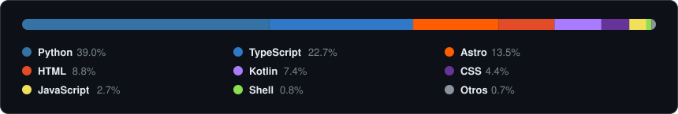
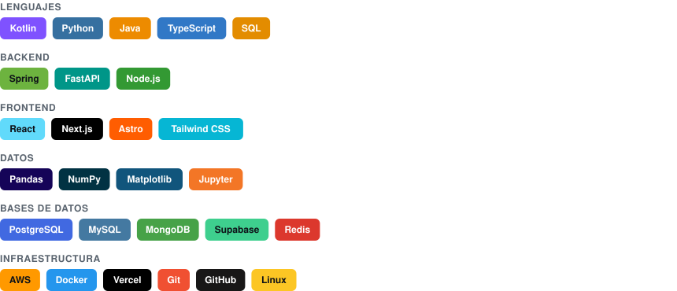

<!-- BEGIN:hero -->

<!-- END:hero -->

<!-- BEGIN:quote -->
> *“Lo que hace el aburrimiento es increíble.”*
>
> 
— <b>Diego Peña y Lillo Luhrs</b>

<!-- END:quote -->

## 🔥 Rachas

<!-- BEGIN:streaks -->

<!-- END:streaks -->

## Repos Principales

<!-- BEGIN:repos -->

<!-- END:repos -->

## 📊 Lenguajes

<!-- BEGIN:languages -->

<!-- END:languages -->

## 🛠️ Tecnologías

<!-- BEGIN:tech -->

<!-- END:tech -->

---

<!-- BEGIN:footer -->
Actualizado automáticamente el 4 ago 2026 por <a href="https://github.com/DiegoPyLL/.github/blob/main/.github/workflows/refresh-readme.yml">GitHub Actions</a> — sin servicios externos en el render.
<!-- END:footer -->
